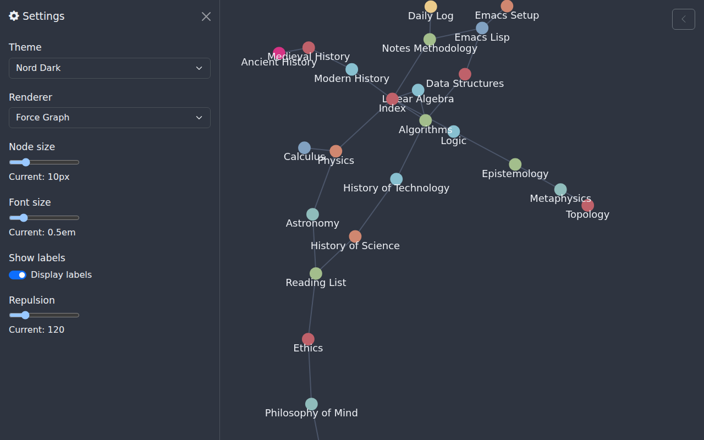
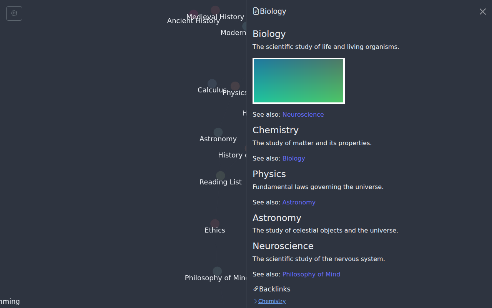

# org-node-ui-lite

A lightweight graph browser for [org-node](https://github.com/meedstrom/org-node) /
[org-mem](https://github.com/meedstrom/org-mem) users.

This is a personal experiment. It forks
[org-roam-ui-lite](https://github.com/tani/org-roam-ui-lite) by Masaya Taniguchi
and replaces the Emacs Lisp backend with one that reads from **org-mem** instead of
the org-roam SQLite database. The front-end (Vite + React + Cytoscape / Force Graph)
is used as-is. Many thanks to Masaya Taniguchi for the original work.

## Screenshots


<details>
<summary>Settings panel / Node details panel</summary>





</details>

## Features

- Graph view of all org-mem ID-nodes and their links
- Click a node to open a side panel with the raw Org content and backlinks
- Org rendering: MathJax, Mermaid diagrams, syntax-highlighted code blocks
- Multiple renderers: Cytoscape, Force Graph 2D/3D
- Themes: Nord Dark, Gruvbox Dark, Dracula Dark, light/dark toggle
- Read-only; no WebSocket required

## Prerequisites

- Emacs 29.4 or later
- [`org-mem`](https://github.com/meedstrom/org-mem) ≥ 0.34 installed and
  `org-mem-updater-mode` enabled
- [`org-node`](https://github.com/meedstrom/org-node) ≥ 1.0 installed
- [`simple-httpd`](https://github.com/skeeto/simple-httpd) ≥ 1.5.1 installed

## Installation

### Manual

```
git clone https://github.com/yewton/org-node-ui-lite.git
cd org-node-ui-lite
cd packages/frontend && npm install && npm run build && cd ../..
```

Add to `init.el`:

```elisp
(add-to-list 'load-path "/path/to/org-node-ui-lite")
(require 'org-node-ui-lite)
(org-node-ui-lite-mode +1)
```

Open <http://localhost:5174/index.html>.

### With borg / straight / use-package

```elisp
;; Example with straight.el
(straight-use-package
 '(org-node-ui-lite :host github :repo "yewton/org-node-ui-lite"
                    :files ("org-node-ui-lite.el" "packages/frontend/dist")))

(require 'org-node-ui-lite)
(org-node-ui-lite-mode +1)
```

## Configuration

```elisp
;; TCP port (default: 5174)
(setq org-node-ui-lite-port 5174)

;; Set to nil to suppress the automatic browser open on startup
(setq org-node-ui-lite-open-on-start t)

;; Enable text caching for faster node content retrieval
(setq org-mem-do-cache-text t)

;; Node visibility in the graph follows org-node-filter-fn.
;; The default excludes nodes tagged ROAM_EXCLUDE.  To customise:
(setq org-node-filter-fn #'my-filter)
```

## Selecting nodes from Emacs

### Explicit selection

Call `M-x org-node-ui-lite-select-current` while the cursor is on any
org-node heading to immediately select and highlight that node in the WebUI.
This works regardless of whether follow-mode is enabled.

### Follow mode

Open the Settings panel in the WebUI and enable **Follow Emacs**.  While
active, the WebUI automatically selects whichever org-node the Emacs cursor
is on (polled every 2 s).

## API

| Endpoint | Description |
|---|---|
| `GET /api/current-node.json` | Cursor position `{id, seq}` for follow-mode |
| `GET /api/graph.json` | All nodes and edges |
| `GET /api/node/{id}.json` | Single node: title, raw Org text, backlinks |
| `GET /api/node/{id}/{path}` | Binary asset (Base64url-encoded filename) |

The full schema is defined in [`openapi.yaml`](openapi.yaml).

## Rebuilding the frontend

If you update the repository (e.g. `git pull`), the pre-built `dist/` directory
is not automatically refreshed — the mode only builds the frontend on first run
when `dist/` is absent.  To force a fresh build after an update, run:

```
M-x org-node-ui-lite-rebuild-frontend
```

This cancels any in-progress build, runs `npm install && npm run build`, and
restarts the HTTP server when done.  A `user-error` is raised if `npm` is not
found on `PATH`.

## Known limitations

- No real-time graph updates; reload the browser to reflect org file changes.
- Read-only: node creation and deletion are out of scope.

## Licence

GNU GPL v3 or later — see [LICENSE.md](LICENSE.md).

Based on [org-roam-ui-lite](https://github.com/tani/org-roam-ui-lite) © 2025
Masaya Taniguchi, also released under the GNU GPL v3 or later.
